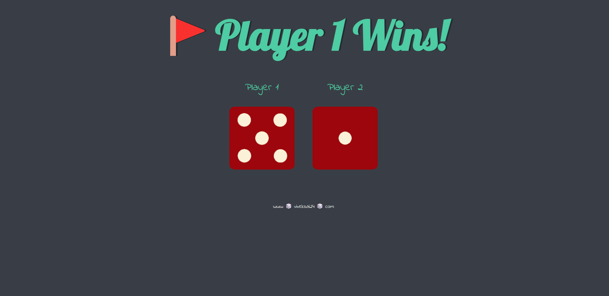

# Dice Game 🎲

Welcome to the **Dice Game**! This is a simple and fun web-based game where two players can roll virtual dice and see who gets the higher number. It's a great way to settle disputes, make decisions, or just have some fun!

## Live Demo 🌐

Check out the live version of the game here:  
👉 [https://viveksai24.github.io/Dice/](https://viveksai24.github.io/Dice/)

## How to Play 🕹️

1. Open the live link above in your browser.
2. The page will automatically "roll" two dice for Player 1 and Player 2.
3. The player with the higher number wins! �
4. Refresh the page to play again.

## Features ✨

- **Simple and intuitive design**: Easy to use for players of all ages.
- **Random dice rolls**: Each roll is completely random, ensuring fair play.
- **Responsive design**: Works seamlessly on both desktop and mobile devices.

## Technologies Used 💻

- **HTML**: Structure of the game.
- **CSS**: Styling and animations.
- **JavaScript**: Logic for rolling the dice and determining the winner.

## How It Works 🛠️

- The game uses JavaScript to generate random numbers between 1 and 6, simulating a dice roll.
- The corresponding dice image is displayed based on the generated number.
- The results are compared, and a winner is declared.

## Screenshot 📸

  

## Contributing 🤝

If you'd like to contribute to this project, feel free to fork the repository and submit a pull request. Here are some ideas for improvements:

- Add a score tracker for multiple rounds.
- Include animations for rolling the dice.
- Allow players to input their names.

## License 📄

This project is open-source and available under the [MIT License](LICENSE).

---

Enjoy the game! If you have any questions or feedback, feel free to reach out. 🎉
